# Lamp Support Adapter for DCL Box

## Problem

During the renovation of my apartment, we replaced the old hanging wires which were used to connect lights by brand new [DCL boxes](https://www.leroymerlin.fr/produits/electricite-domotique/interrupteur-et-prise/boite-encastrement/kit-applique-dcl-parois-pleins-legrand-82203701.html) which are way more secure. 

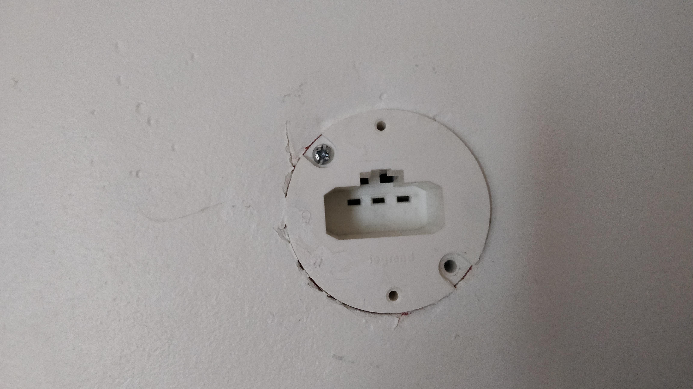

But unfortunately, I wanted to mount [this lamp](https://www.leroymerlin.fr/produits/decoration-eclairage/luminaire-interieur/spot/spot-deco/spot-patere-naturel-metal-bois-clair-brilliant-babsan-79939475.html) which is not compatible with the newly installed DCL box.

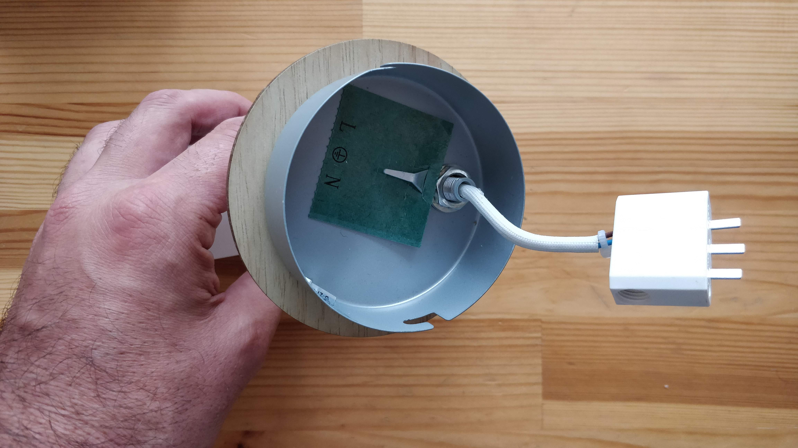

As there is no existing adapter to make this possible, I decided to design one with [FreeCAD](https://www.freecadweb.org/) which can be 3D printed in order to be able to use this lamp. The main constraint was to 
rely on the existing screws which are holding the DCL box on the wall. 

## Design

### 3D Model

After taking all the measurements, I designed a [sketch](https://wiki.freecadweb.org/Sketcher_Workbench) in order have a model of the whole situation.

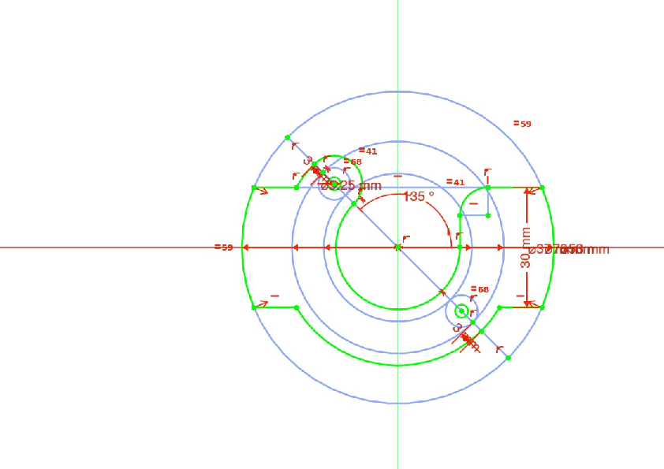.

I did a first extrusion based on this sketch in order to obtain the part which will be skrewed on the wall by the DCL box skrews. 

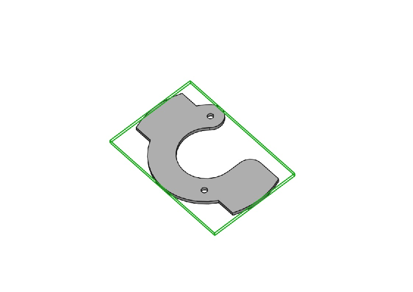

Then I did another extrusion to make the part that will actually hold the lamp support.

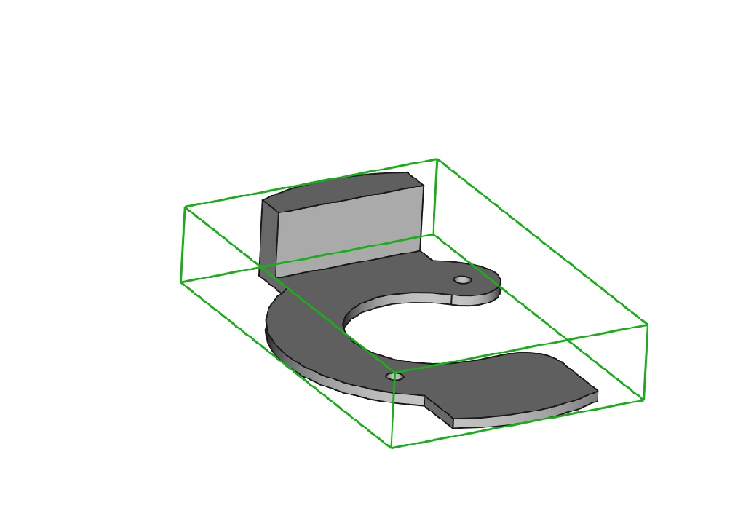

And I added a hole in order to put the nut which is going to hold the skrew which tighten the lamp support to the adapter itself. 

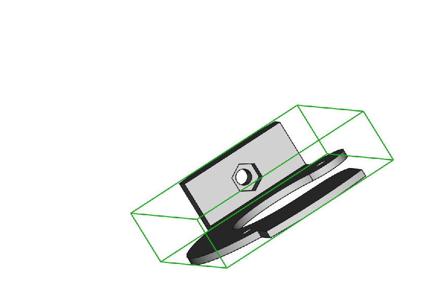

And finally, a mirror part to make the other side.

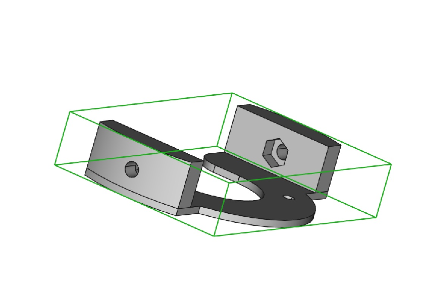

## Cardboard Draft

Before 3D printing the whole piece, I exported [a plan](Plan.pdf) using the [TechDraw workbench](https://wiki.freecadweb.org/TechDraw_Module), printed it and glued it on carboard to see if everything fit well. 

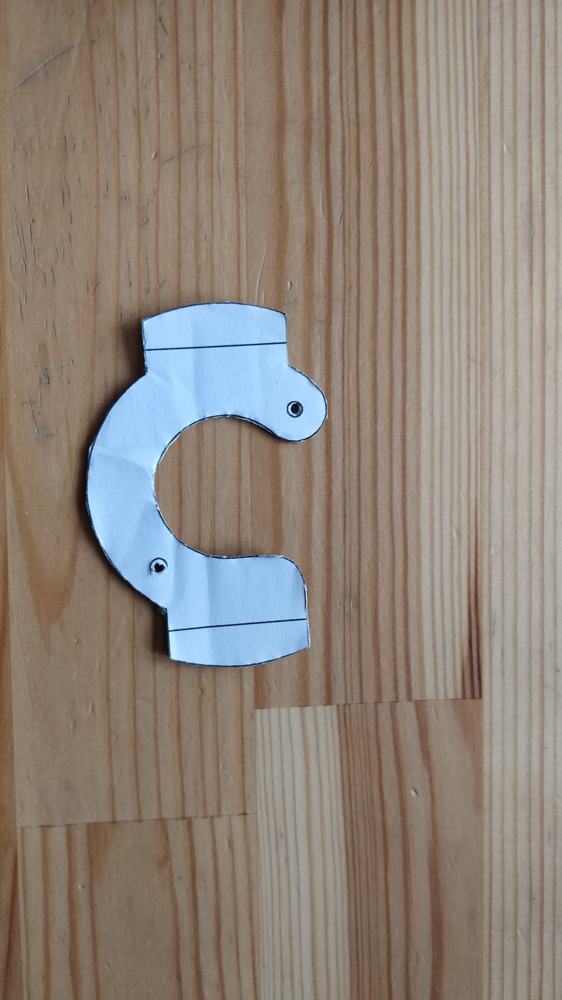

## 3D Printing

Everything went well, so with the help of my friend Xavier, we printed the piece using a [???](???). I also glued the nuts to the piece using [Locite](https://www.amazon.fr/gp/product/B0000WRNVW/ref=ppx_yo_dt_b_asin_title_o00_s00?ie=UTF8&psc=1). 

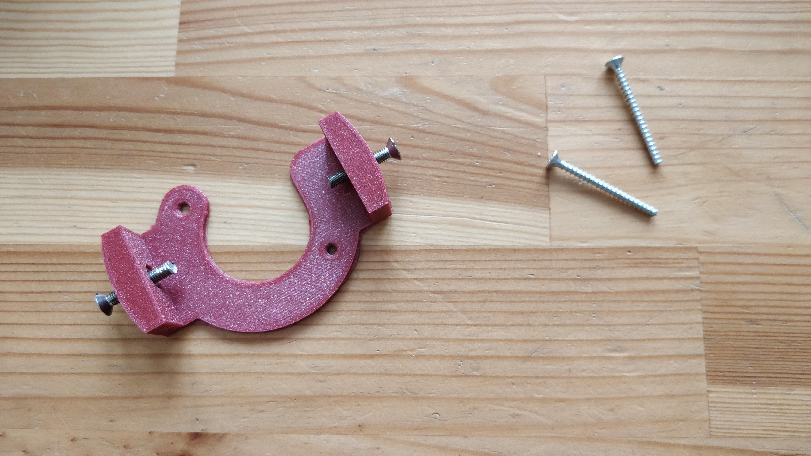

## Installation

Not a lot to say about this because everything went smoothly! 

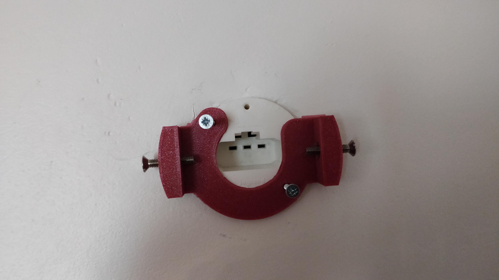

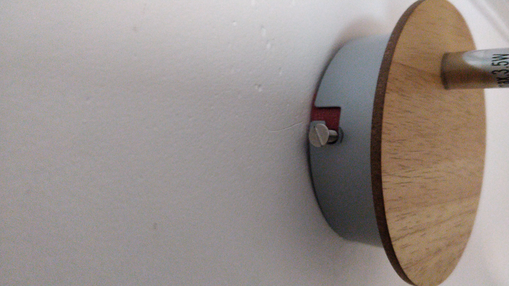

# Ending

And there will be light! 

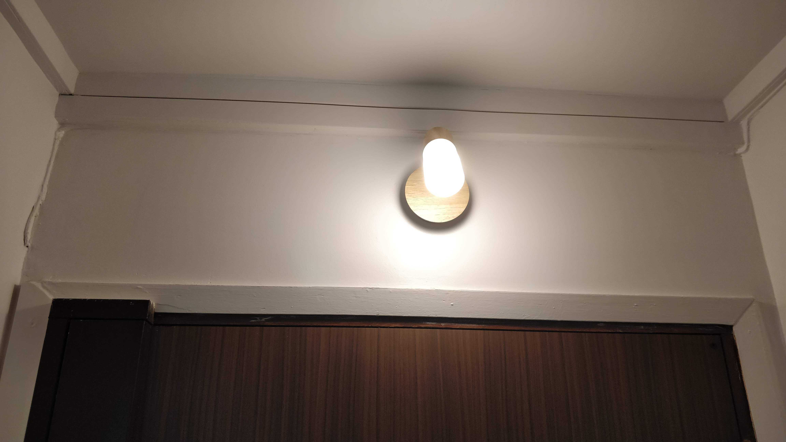

